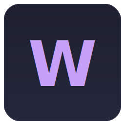

<h3 align="center">
   
</h3>

  
  
  

- [🪴 Overview](#-overview)
- [🖼️ Features](#️-features)
- [🖼️ References](#️-references)

## 🪴 Overview

A curated collection of high-quality wallpapers, organized by tags for easy browsing and downloading. Perfect for desktops, laptops, and NixOS setups.

✨ **Browse & Download** wallpapers using the web app: [pivoshenko-wallpapers](https://pivoshenko-wallpapers.netlify.app)
📄 **See the full list** of wallpapers in [WALLPAPERS.md](./WALLPAPERS.md)
📋 **Useful buttons** for NixOS users to quickly copy the `lib.fetchUrl()` function

## 🖼️ Features

- Curated, high-resolution wallpapers
- Tagged for easy search and navigation
- Direct download links
- NixOS-friendly fetch buttons

## 🖼️ References

- `<https://github.com/zDyanTB/aesthetic-wallpapers>`
- `<https://github.com/D3Ext/aesthetic-wallpapers>`
- `<https://github.com/orangci/walls-catppuccin-mocha>`
